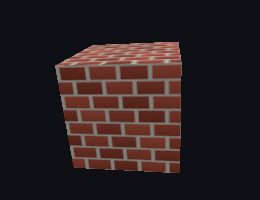

<!--
Copyright (c) 2026 Seth Kitchen, PE
SPDX-License-Identifier: PolyForm-Noncommercial-1.0.0
-->

# ThreeMojo

[](LICENSE)
[](https://mojolang.org)
[](https://github.com/SethKitchen/ThreeMojo/wiki/Coverage-tool)



Rendered by `examples/photo.mojo`: a PNG decoded by this project, on a cube, seen from a camera that rides the scene graph.

ThreeMojo is a port of [three.js](https://threejs.org) to [Mojo](https://mojolang.org). It renders 3D scenes in software on the CPU, or on a GPU, and writes PNG files. It depends on the Mojo standard library and nothing else. The GPU backend is one file and needs MAX.

The project exists to learn graphics and Mojo from first principles. It is not a drop-in replacement for three.js. The [feature checklist](#features) says what is ported.

## Install

Supported platforms: macOS on Apple Silicon, Linux on x86-64 or aarch64, and Windows through WSL 2. You need Python 3.9 or later, `git`, `make` and [uv](https://docs.astral.sh/uv/).

```bash
git clone https://github.com/SethKitchen/ThreeMojo.git
cd ThreeMojo
uv venv --prompt ThreeMojo
uv pip install "mojo==1.0.0"
uv pip install "max==26.5.0"      # optional: the GPU backend
```

[How to install](https://github.com/SethKitchen/ThreeMojo/wiki/How-to-install) covers WSL 2, the Metal toolchain and the editor setup.

## Start

```bash
make check-cpu                                            # format, lint, tests, docs
make animation                                            # every example, into out/
.venv/bin/mojo run -I . examples/cubes.mojo out/cubes.png
```

Then follow [Tutorial: render your first scene](https://github.com/SethKitchen/ThreeMojo/wiki/Tutorial-Render-your-first-scene).

## Documentation

The [wiki](https://github.com/SethKitchen/ThreeMojo/wiki) follows [Diátaxis](https://diataxis.fr). Tutorials teach. How-to guides solve one task. Reference pages describe each feature. Explanation pages say why the design is what it is.

The pages live in [`docs/wiki/`](docs/wiki) and are published to the wiki on every push to `main`. `make docs-check` enforces the [writing rules](https://github.com/SethKitchen/ThreeMojo/wiki/How-to-write-documentation).

## Features

A ticked item is ported, tested with full coverage, and documented on the linked wiki page. An unticked item is a three.js feature that is not ported yet. Each item has a GitHub issue.

<!-- features -->
### Scene

- [x] [Scene graph](https://github.com/SethKitchen/ThreeMojo/wiki/Scene-graph): `Object3D`, `Scene`, parent and child transforms [#1](https://github.com/SethKitchen/ThreeMojo/issues/1)
- [x] [Quaternion and Euler rotations](https://github.com/SethKitchen/ThreeMojo/wiki/Rotations): six Euler orders, `rotate_x`, `rotate_y`, `rotate_z`, `look_at`, `slerp` [#2](https://github.com/SethKitchen/ThreeMojo/issues/2)
- [x] [PerspectiveCamera](https://github.com/SethKitchen/ThreeMojo/wiki/Cameras#perspectivecamera) [#3](https://github.com/SethKitchen/ThreeMojo/issues/3)
- [x] [OrthographicCamera](https://github.com/SethKitchen/ThreeMojo/wiki/Cameras#orthographiccamera) [#4](https://github.com/SethKitchen/ThreeMojo/issues/4)
- [x] [Camera on a scene node](https://github.com/SethKitchen/ThreeMojo/wiki/Cameras#attach-a-camera-to-a-node): `attach`, orbit with a pivot [#5](https://github.com/SethKitchen/ThreeMojo/issues/5)
- [ ] CubeCamera [#6](https://github.com/SethKitchen/ThreeMojo/issues/6)
- [ ] ArrayCamera and StereoCamera [#7](https://github.com/SethKitchen/ThreeMojo/issues/7)
- [ ] Fog and FogExp2 [#8](https://github.com/SethKitchen/ThreeMojo/issues/8)
- [ ] Scene background and environment [#9](https://github.com/SethKitchen/ThreeMojo/issues/9)
- [ ] Layers [#10](https://github.com/SethKitchen/ThreeMojo/issues/10)
- [ ] Clock [#11](https://github.com/SethKitchen/ThreeMojo/issues/11)

### Geometry

- [x] [BufferGeometry and BufferAttribute](https://github.com/SethKitchen/ThreeMojo/wiki/Geometry) [#12](https://github.com/SethKitchen/ThreeMojo/issues/12)
- [x] [BoxGeometry](https://github.com/SethKitchen/ThreeMojo/wiki/Geometry#box) [#13](https://github.com/SethKitchen/ThreeMojo/issues/13)
- [x] [SphereGeometry](https://github.com/SethKitchen/ThreeMojo/wiki/Geometry#sphere) [#14](https://github.com/SethKitchen/ThreeMojo/issues/14)
- [x] [PlaneGeometry](https://github.com/SethKitchen/ThreeMojo/wiki/Geometry#plane) [#15](https://github.com/SethKitchen/ThreeMojo/issues/15)
- [x] [CircleGeometry and RingGeometry](https://github.com/SethKitchen/ThreeMojo/wiki/Geometry#circle): pie slices and arcs with a start angle and a sweep [#16](https://github.com/SethKitchen/ThreeMojo/issues/16)
- [ ] CylinderGeometry and ConeGeometry [#17](https://github.com/SethKitchen/ThreeMojo/issues/17)
- [ ] TorusGeometry and TorusKnotGeometry [#18](https://github.com/SethKitchen/ThreeMojo/issues/18)
- [ ] Polyhedron geometries: Icosahedron, Octahedron, Tetrahedron, Dodecahedron [#19](https://github.com/SethKitchen/ThreeMojo/issues/19)
- [ ] CapsuleGeometry [#20](https://github.com/SethKitchen/ThreeMojo/issues/20)
- [ ] LatheGeometry and TubeGeometry [#21](https://github.com/SethKitchen/ThreeMojo/issues/21)
- [ ] ShapeGeometry and ExtrudeGeometry [#22](https://github.com/SethKitchen/ThreeMojo/issues/22)
- [ ] EdgesGeometry and WireframeGeometry [#23](https://github.com/SethKitchen/ThreeMojo/issues/23)
- [ ] computeVertexNormals and bounding volumes [#24](https://github.com/SethKitchen/ThreeMojo/issues/24)

### Objects

- [x] [Mesh, with geometry, material and texture stores](https://github.com/SethKitchen/ThreeMojo/wiki/Meshes-and-assets) [#25](https://github.com/SethKitchen/ThreeMojo/issues/25)
- [ ] Line and LineSegments [#26](https://github.com/SethKitchen/ThreeMojo/issues/26)
- [ ] Points [#27](https://github.com/SethKitchen/ThreeMojo/issues/27)
- [ ] Sprite [#28](https://github.com/SethKitchen/ThreeMojo/issues/28)
- [ ] InstancedMesh and BatchedMesh [#29](https://github.com/SethKitchen/ThreeMojo/issues/29)
- [ ] SkinnedMesh, Bone and Skeleton [#30](https://github.com/SethKitchen/ThreeMojo/issues/30)
- [ ] LOD [#31](https://github.com/SethKitchen/ThreeMojo/issues/31)

### Materials

- [x] [MeshLambertMaterial](https://github.com/SethKitchen/ThreeMojo/wiki/Materials#kind): lit per fragment [#32](https://github.com/SethKitchen/ThreeMojo/issues/32)
- [x] [MeshBasicMaterial](https://github.com/SethKitchen/ThreeMojo/wiki/Materials#kind): unlit [#33](https://github.com/SethKitchen/ThreeMojo/issues/33)
- [x] [Front, back and double side](https://github.com/SethKitchen/ThreeMojo/wiki/Materials#side) [#34](https://github.com/SethKitchen/ThreeMojo/issues/34)
- [x] [Opacity and blending](https://github.com/SethKitchen/ThreeMojo/wiki/Materials#opacity-and-blending) [#35](https://github.com/SethKitchen/ThreeMojo/issues/35)
- [x] [Color map](https://github.com/SethKitchen/ThreeMojo/wiki/Materials): a texture on a material [#36](https://github.com/SethKitchen/ThreeMojo/issues/36)
- [ ] MeshPhongMaterial [#37](https://github.com/SethKitchen/ThreeMojo/issues/37)
- [ ] MeshStandardMaterial and MeshPhysicalMaterial [#38](https://github.com/SethKitchen/ThreeMojo/issues/38)
- [ ] MeshNormalMaterial and MeshDepthMaterial [#39](https://github.com/SethKitchen/ThreeMojo/issues/39)
- [ ] MeshToonMaterial and MeshMatcapMaterial [#40](https://github.com/SethKitchen/ThreeMojo/issues/40)
- [ ] LineBasicMaterial and LineDashedMaterial [#41](https://github.com/SethKitchen/ThreeMojo/issues/41)
- [ ] PointsMaterial and SpriteMaterial [#42](https://github.com/SethKitchen/ThreeMojo/issues/42)
- [ ] ShadowMaterial [#43](https://github.com/SethKitchen/ThreeMojo/issues/43)
- [ ] Normal maps and bump maps [#44](https://github.com/SethKitchen/ThreeMojo/issues/44)
- [ ] Emissive color and emissive map [#45](https://github.com/SethKitchen/ThreeMojo/issues/45)
- [ ] Alpha map and alpha test [#46](https://github.com/SethKitchen/ThreeMojo/issues/46)
- [ ] Vertex colors [#47](https://github.com/SethKitchen/ThreeMojo/issues/47)
- [ ] Wireframe rendering [#48](https://github.com/SethKitchen/ThreeMojo/issues/48)
- [ ] Texture transforms: repeat, offset, rotation [#49](https://github.com/SethKitchen/ThreeMojo/issues/49)

### Lights

- [x] [AmbientLight](https://github.com/SethKitchen/ThreeMojo/wiki/Lights#ambient) [#50](https://github.com/SethKitchen/ThreeMojo/issues/50)
- [x] [DirectionalLight](https://github.com/SethKitchen/ThreeMojo/wiki/Lights#directional) [#51](https://github.com/SethKitchen/ThreeMojo/issues/51)
- [x] [PointLight](https://github.com/SethKitchen/ThreeMojo/wiki/Lights#point): inverse-square falloff, decay, cutoff distance [#52](https://github.com/SethKitchen/ThreeMojo/issues/52)
- [x] [Per-fragment Lambert shading](https://github.com/SethKitchen/ThreeMojo/wiki/Rasterization#shading) [#53](https://github.com/SethKitchen/ThreeMojo/issues/53)
- [ ] SpotLight [#54](https://github.com/SethKitchen/ThreeMojo/issues/54)
- [ ] HemisphereLight [#55](https://github.com/SethKitchen/ThreeMojo/issues/55)
- [ ] RectAreaLight [#56](https://github.com/SethKitchen/ThreeMojo/issues/56)
- [ ] Shadow maps [#57](https://github.com/SethKitchen/ThreeMojo/issues/57)

### Textures

- [x] [Texture with repeat, clamp and mirror wrapping](https://github.com/SethKitchen/ThreeMojo/wiki/Textures#wrap) [#58](https://github.com/SethKitchen/ThreeMojo/issues/58)
- [x] [Nearest and bilinear filters](https://github.com/SethKitchen/ThreeMojo/wiki/Textures#filter) [#59](https://github.com/SethKitchen/ThreeMojo/issues/59)
- [x] [Mipmaps and trilinear filtering](https://github.com/SethKitchen/ThreeMojo/wiki/Textures#mipmaps) [#60](https://github.com/SethKitchen/ThreeMojo/issues/60)
- [x] [sRGB and linear color spaces](https://github.com/SethKitchen/ThreeMojo/wiki/Textures#color-space) [#61](https://github.com/SethKitchen/ThreeMojo/issues/61)
- [x] [PNG loader](https://github.com/SethKitchen/ThreeMojo/wiki/Image-files#read-a-png): every 8-bit color type, every filter, both Huffman block types [#62](https://github.com/SethKitchen/ThreeMojo/issues/62)
- [ ] CubeTexture and environment maps [#63](https://github.com/SethKitchen/ThreeMojo/issues/63)
- [ ] DataTexture [#64](https://github.com/SethKitchen/ThreeMojo/issues/64)
- [ ] CompressedTexture [#65](https://github.com/SethKitchen/ThreeMojo/issues/65)
- [ ] DepthTexture [#66](https://github.com/SethKitchen/ThreeMojo/issues/66)
- [ ] Anisotropic filtering [#67](https://github.com/SethKitchen/ThreeMojo/issues/67)
- [ ] Render target as a texture [#68](https://github.com/SethKitchen/ThreeMojo/issues/68)
- [ ] JPEG loader [#69](https://github.com/SethKitchen/ThreeMojo/issues/69)
- [ ] GLTF loader [#70](https://github.com/SethKitchen/ThreeMojo/issues/70)
- [ ] OBJ loader [#71](https://github.com/SethKitchen/ThreeMojo/issues/71)

### Rendering

- [x] [Depth buffer](https://github.com/SethKitchen/ThreeMojo/wiki/Rasterization#depth) [#72](https://github.com/SethKitchen/ThreeMojo/issues/72)
- [x] [Backface culling](https://github.com/SethKitchen/ThreeMojo/wiki/Rasterization#culling) [#73](https://github.com/SethKitchen/ThreeMojo/issues/73)
- [x] [Near and far clipping](https://github.com/SethKitchen/ThreeMojo/wiki/Rasterization#clipping) [#74](https://github.com/SethKitchen/ThreeMojo/issues/74)
- [x] [Perspective-correct interpolation](https://github.com/SethKitchen/ThreeMojo/wiki/Rasterization#interpolation) [#75](https://github.com/SethKitchen/ThreeMojo/issues/75)
- [x] [Alpha blending with sorted draw order](https://github.com/SethKitchen/ThreeMojo/wiki/Rasterization#transparency) [#76](https://github.com/SethKitchen/ThreeMojo/issues/76)
- [x] [Linear-light compositing and sRGB output](https://github.com/SethKitchen/ThreeMojo/wiki/Render-target-and-framebuffer) [#77](https://github.com/SethKitchen/ThreeMojo/issues/77)
- [x] [Multithreaded CPU renderer](https://github.com/SethKitchen/ThreeMojo/wiki/Renderer#workers) [#78](https://github.com/SethKitchen/ThreeMojo/issues/78)
- [x] [GPU rasterizer](https://github.com/SethKitchen/ThreeMojo/wiki/GPU-backend): the same rasterizer as a MAX kernel [#79](https://github.com/SethKitchen/ThreeMojo/issues/79)
- [x] [PNG, APNG and PPM writers](https://github.com/SethKitchen/ThreeMojo/wiki/Image-files) [#80](https://github.com/SethKitchen/ThreeMojo/issues/80)
- [ ] Frustum culling [#81](https://github.com/SethKitchen/ThreeMojo/issues/81)
- [ ] Tone mapping [#82](https://github.com/SethKitchen/ThreeMojo/issues/82)
- [ ] Anti-aliasing [#83](https://github.com/SethKitchen/ThreeMojo/issues/83)
- [ ] Scissor and viewport [#84](https://github.com/SethKitchen/ThreeMojo/issues/84)
- [ ] Post-processing [#85](https://github.com/SethKitchen/ThreeMojo/issues/85)
- [ ] Helpers: axes, grid, box, camera [#86](https://github.com/SethKitchen/ThreeMojo/issues/86)
- [ ] Windowing and interactive controls [#87](https://github.com/SethKitchen/ThreeMojo/issues/87)

### Animation

- [ ] AnimationMixer, AnimationClip and KeyframeTrack [#88](https://github.com/SethKitchen/ThreeMojo/issues/88)
- [ ] Morph targets [#89](https://github.com/SethKitchen/ThreeMojo/issues/89)
- [ ] Skinning [#90](https://github.com/SethKitchen/ThreeMojo/issues/90)

### Math and foundations

- [x] [Vector2, Vector3, Matrix4 and projection matrices](https://github.com/SethKitchen/ThreeMojo/wiki/Math) [#91](https://github.com/SethKitchen/ThreeMojo/issues/91)
- [x] [Compile-time units](https://github.com/SethKitchen/ThreeMojo/wiki/Units): meters, degrees, dimension checks [#92](https://github.com/SethKitchen/ThreeMojo/issues/92)
- [x] [Coverage tool](https://github.com/SethKitchen/ThreeMojo/wiki/Coverage-tool): line, branch, condition and MC/DC [#93](https://github.com/SethKitchen/ThreeMojo/issues/93)
- [x] [Euler angles from a quaternion](https://github.com/SethKitchen/ThreeMojo/wiki/Rotations#euler-and-eulerorder): all six orders, gimbal lock as in three.js, `Object3D.rotation` [#94](https://github.com/SethKitchen/ThreeMojo/issues/94)
- [ ] Matrix3 and Vector4 [#95](https://github.com/SethKitchen/ThreeMojo/issues/95)
- [ ] Box3, Sphere and Plane [#96](https://github.com/SethKitchen/ThreeMojo/issues/96)
- [ ] Ray and Raycaster [#97](https://github.com/SethKitchen/ThreeMojo/issues/97)
- [ ] Curves and paths [#98](https://github.com/SethKitchen/ThreeMojo/issues/98)
- [ ] Color as floats [#99](https://github.com/SethKitchen/ThreeMojo/issues/99)
<!-- /features -->

### Out of scope

Browser-only features have no place in a software renderer: the WebGL and WebGPU renderers, the CSS renderers, WebXR, audio, and video and canvas textures.

## Contributing

Open an issue before a large change. Run `make check` before you commit. Coverage must stay at 100%. Documentation must pass `make docs-check`. [CONTRIBUTING.md](CONTRIBUTING.md) has the rules and the steps to add a feature.

## License

ThreeMojo is free for noncommercial use under the [PolyForm Noncommercial License 1.0.0](LICENSE): personal projects, study, research, and use by charities, schools and government bodies.

Commercial use requires a paid license. See [LICENSE-COMMERCIAL.md](LICENSE-COMMERCIAL.md).

Copyright © 2026 Seth Kitchen, PE.

`math/` and `render/` are ported from three.js, which is MIT licensed. Those notices are preserved in [THIRD-PARTY-NOTICES.md](THIRD-PARTY-NOTICES.md). Nothing here restricts your rights in three.js itself. `coverage/` is original work with no three.js lineage.
